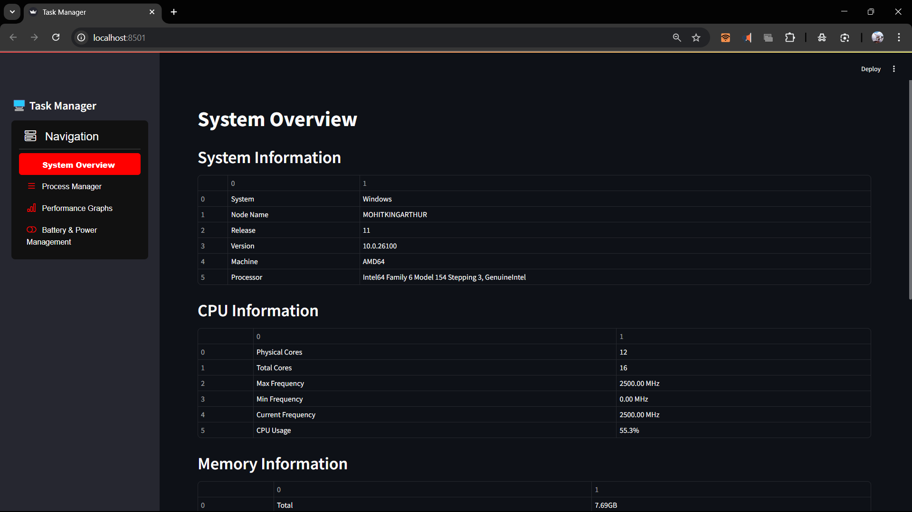
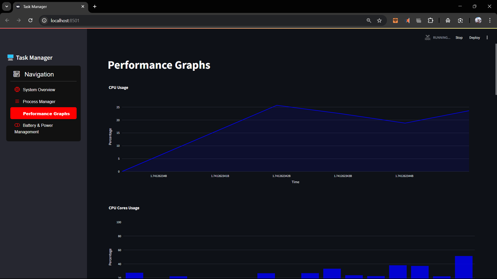
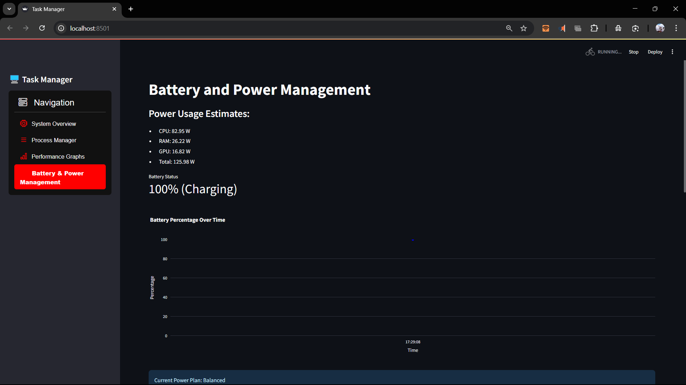

https://drive.google.com/file/d/1-LrqqDKbzIwkZ5M4j8_6vTMAVL7CEq3G/view?usp=sharing
open this extract and double click on .bat file 
working on this again to make it able to run on any windows directly


- YOUTUBE https://youtu.be/eyDMbcqP1Y4
- DOCKER HUB - coming soon
# Task Manager App

## 📌 Overview
A Streamlit-based **Task Manager App** that provides real-time system monitoring, process management, performance graphs, and battery power management. This application offers a simple UI for users to track and control system resources efficiently.

## 📜 Features

### 1️⃣ System Overview
- Displays **System Information** (OS, Processor, Machine, etc.).
- Shows **CPU Information** (Cores, Frequency, Usage, etc.).
- Monitors **Memory Usage** (Total, Used, Available, Swap Memory, etc.).
- Displays **Disk Information** (Total, Used, Free Space).
- Detects and shows **GPU Information** (NVIDIA GPU Memory & Utilization).

### 2️⃣ Process Manager
- Lists all active system processes.
- Allows **sorting by CPU or Memory usage**.
- Displays process details (PID, Name, CPU%, Memory%, Status).
- Provides an option to **terminate processes** via PID.

### 3️⃣ Performance Graphs
- **Real-time graphs** for:
  - CPU Usage (Overall & Core-wise).
  - Memory Usage.
  - Disk Utilization.
  - GPU Utilization.
  - Network Activity (Bytes Sent/Received).

### 4️⃣ Battery & Power Management
- Displays **Battery Status & Percentage**.
- Provides **Estimated Battery Time Remaining**.
- Shows **Current Power Plan**.
- **Tracks Battery Level over time** using interactive graphs.
- Estimates system **Power Consumption (CPU, RAM, GPU)**.

## 🛠️ Installation & Setup

### Prerequisites
Ensure you have the following installed:
- Python (>=3.8)
- Pip

### Installation Steps
1. Clone the repository:
   ```bash
   git clone https://github.com/your-username/task-manager-app.git
   cd task-manager-app
   ```
2. Create a virtual environment (optional but recommended):
   ```bash
   python -m venv env
   source env/bin/activate  # On Windows: env\Scripts\activate
   ```
3. Install dependencies:
   ```bash
   pip install -r requirements.txt
   ```
4. Run the application:
   ```bash
   streamlit run app.py
   ```

## 🔧 Tech Stack
- **Python**
- **Streamlit** (for UI)
- **Psutil** (for system monitoring)
- **Pynvml** (for GPU information)
- **Plotly** (for interactive graphs)
- **Tabulate** (for formatted tables)

## 📷 Screenshots





## 📌 Future Enhancements
- pyspectator (cross os library) is having dependency issues
- GPUtil is causing issues due to updated GPU drivers
- Improve process filtering options.
- Enhance GPU monitoring for **AMD GPUs**.
- Add customizable alert notifications for **high CPU & memory usage**.

## 🤝 Contributing
Feel free to fork the repo, create feature branches, and submit pull requests.

## 📬 Contact
For issues or suggestions, reach out via [GitHub Issues](https://github.com/your-username/task-manager-app/issues).

